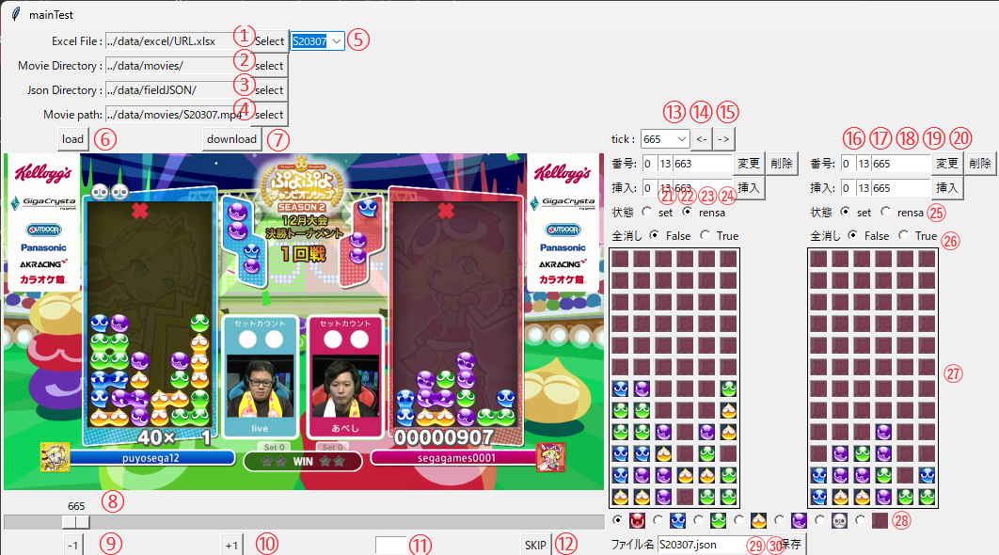
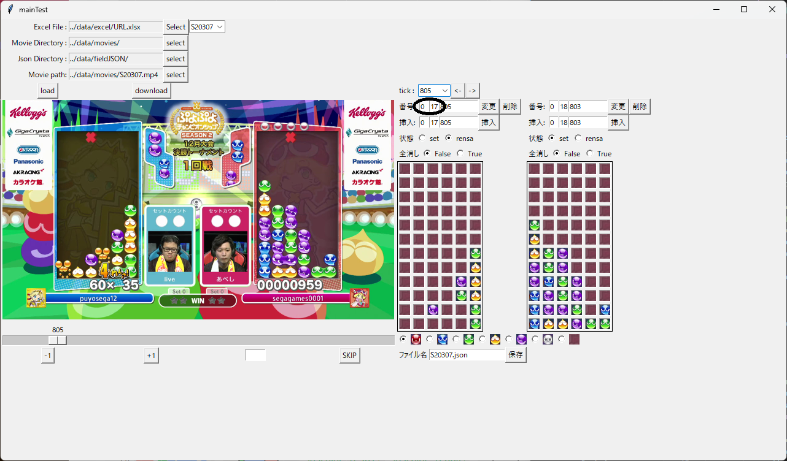
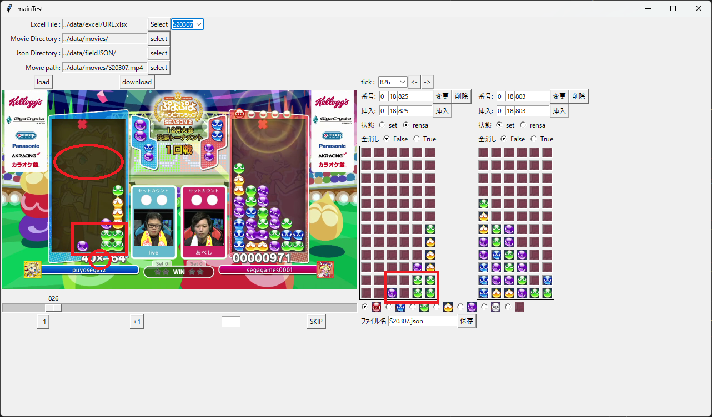

# ぷよ譜編集ツール

#### 修正

##### 2024/05/07 
- reloadボタンを実装しました. 押すことでjsonファイルを再読み込みできます.
- 挿入ボタンに関するバグを修正しました
- 保存ボタンに関するバグを修正しました
- 手番が進んだプレイヤーの枠線の色を変更するようにしました 
- 盤番号の表示を変更しました.

## 導入部

このツールは, GUIを介してぷよ譜の編集を行うことを目的としています. ユーザーはビデオとぷよ譜データの閲覧・編集が可能で, 具体的にはファイルの読み込みから盤の編集, 動画のコントロールまで幅広い機能を提供します.

## インストール

ディレクトリをpuyofuEditerに設定後, 以下のコマンドを実行して必要なライブラリをインストールします：

`pip` install -r requirements.txt

## 起動方法

1.  コマンドプロンプトやターミナルを開きます
2.  プロジェクトのsrcディレクトリまで移動します.
    以下のコマンドを実行してください :
    - `cd` main.pyが存在するディレクトリパス”
3.  移動先のディレクトリで以下のコマンドを実行してください：
    - `python` main.py

## 機能

ユーザーはGUI上からファイルパスや棋譜の編集を行えます。これにより、動画ファイルやぷよ譜データファイルを適切に管理し、必要な作業環境を整えることができます。

※旧バージョンの画像が表示されています

### 1. excelファイルの設定

- ①試合情報が記載された`.xlsx`ファイルを指定します。このファイルには試合の基本情報が含まれており、GUI上で自動的にデフォルトパスから読み込まれます。
- ファイルの読み込みに成功すると、GUI上に試合番号を選択するための⑤プルダウンメニューが表示されます。試合番号は「S+整数5桁」の形式で表されます。

### 2. 動画ファイルが配置されているディレクトリの設定

- ②動画(`.mp4`, `.webm`など)ファイルが配置されたディレクトリを指定します.

### 3. jsonファイルが配置されているディレクトリの設定

- ③`.json`ファイルが配置されたディレクトリを指定します

### 4. 動画ファイルの設定

- ④読み込む動画ファイルを設定します.

### 5. 動画ファイルの読み込みとコントロール

⑥-⑫動画ファイルを読み込み, 以下のような基本的な操作がGUI上で行えます：

- コマ送りと早送り
- シークバーによる再生位置の変更

### 6. 棋譜データの読み込みと編集

⑬-㉘JSON形式で保存されたぷよ譜データを読み込み、以下の編集が可能です：

- 読み込むページを指定
- 各手のパラメータの変更
- 盤の編集
- ぷよ譜に新しい手を追加または削除
- 記録したtick(時間)の変更

画面右側の詳細な機能説明です. 
- ⑬ ぷよ譜に記録された瞬間(tick)の一覧から読みこむデータを選択できます.
- ⑭⑮ 「<-」「 -\>」 ボタンで次の手に移動できます
- ⑯⑰⑱ 現在参照している手の⑰ゲーム番号, ⑩手番号, ⑱時間を表示します. 
- ⑲ ⑯ゲーム⑰手目の盤を⑱指定したtickに変更します
- ⑳ ⑯ゲーム⑰手目の盤の削除が行えます.

  ゲーム0, 盤番号1の場合

      操作前 [field0, field1, field2,...]
      操作後 [field0, field2, field3,...]

- ㉑㉒㉓㉔ 上記と同様にして対応した盤の位置に指定したtickで新たに手を挿入できます. 挿入される盤は指定位置のものをコピーします. 

  ゲーム0, 盤番号1 の場合

      操作前 [field0, field1, field2,...]
      操作後 [field0, new_field, field1, field2,...]

- ㉕ 取得タイミングが連鎖によるものかどうかを設定します. 
- ㉖ 現在全消し中かどうか設定します.
- ㉗ 取得した盤を表示します. ㉘で色を選択しクリックすることで色を変更することができます.
- ㉘ 盤に配置するぷよの色を変更できます. 一番右は背景に対応しています. 
- ㉙ 設定したファイル名でファイルを保存します.
  保存先はデフォルトで`puyofuEditer/data/outPuts/` です

### 7. ファイルの保存

㉘㉙`.json`ファイルを保存します

## 操作手順
編集作業を進める際には以下の手順に従うと良いでしょう. 

#### 1. ①-④　各種パスの設定

- 通常はデフォルト設定で問題ありませんが、異なるファイルやディレクトリを使用する場合は、ファイル選択ダイアログを通じて新しいパスを指定できます。

#### 2. ⑤ 大会番号の選択

- §1の操作が正常に完了すると大会番号の一覧が選択できる⑤コンボボックスが表示されます. 作業を行う番号を選んでください

#### 3. ⑥⑦動画の設定

§2の後⑥loadをクリックすると動画を読み込みます. ②Movie Directory に該当する動画が存在しない場合警告が出るので, ⑦ダウンロードボタンをクリックして動画をダウンロードして下さい. ダウンロードの進捗はターミナル(VSCodeの下部とか)に表示され, 通常数分以内に終了します.

#### 4. ⑧-㉘ぷよ譜の修正

修正作業の準備ができました. 以下の順番で各盤面を確認し修正を行ってください

1. ⑭「<-」⑮「->」ボタンをクリックして手番を進めます.
2. 手番が進んだプレイヤーは枠線の色が変わります. 画面右枠線の色を確認し, グレーになったプレイヤーに注目します
3. 動画とぷよ譜を照らし合わせ以下の点について確認を行います
  - 取得タイミングがずれていないか
  - 余分に手を取得していないか, 手が飛んでいないか(飛んでいた場合は挿入, 余分なものは削除して対応します)
  - 盤は正しいか
  - 取得は連鎖によるものか
  - 全消し中か

    ※取得タイミングは連鎖が起きずnext(画面中央上部)が動き始めた, もしくは連鎖演出が始まった(画面下部スコアの×印が出現)した瞬間です

今回の場合,
- 取得タイミングは連鎖の演出が始まった瞬間(取得が早すぎた)ので左下の+1, -1ボタンで時間を調整し変更ボタンを押す
- 紫と緑の位置がおかしいので適切な位置に修正＆追加
- 画面下部にバツ印が出ているため状態をrensa
- 盤中央に全消しという文字が出ていないので全消しをfalseに

これを繰り返すことで正しいぷよ譜を作成していきます. 

#### 5. ㉙㉚ ファイルの保存

修正したファイルは保存ボタンを押さないと保存されません. ファイル名を確認したのち保存してください

#### 6. 保存したぷよ譜の確認

1. ③Json Directoryの「select」ボタンを押しディレクトリを`../data/outPuts`に変更する. 
2. 「reload」ボタンを押しjsonファイルを読み込む
3. 修正後のぷよ譜を確認しミスがあったら修正します.

## ディレクトリ構造

    puyofuEditer/
    ├── README.md
    ├── docs/
    │   └── README_images/
    ├── src/
    │   ├── main.py 
    │   ├── movieFrame.py 
    │   ├── editFrame.py
    │   └── entryFrame.py
    ├── data/
    │   ├── excel/
    │   │   └──URL.xlsx
    │   ├── fieldJSON/ 
    │   │   └──(puyofu_datafiles)
    │   ├── movies/
    │   │   └──(movie_datafiels)
    │   └── images/
    │       └── (puyo_images)
    └── requirements.txt

## 注意

- デバッグ作業が不十分なので作成後は必ず確認を行って下さい.
  jsonディレクトリの設定をoutputに変更することで作成後のデータを確認できます.
- 一部エラーはerror.logに出力されるように設定しています.
